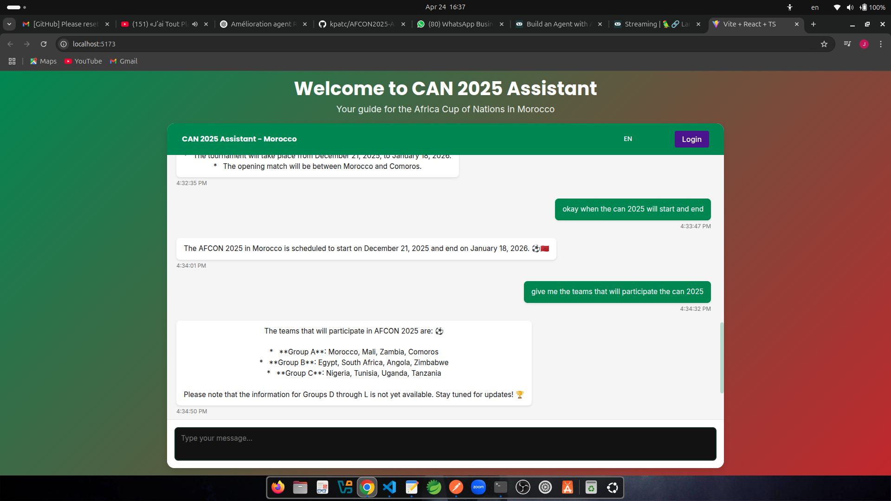

# AFCON 2025 Information Retrieval System

## Overview

**CAN 2025 Assistant** is an AI-powered chatbot designed to assist users with any questions related to the Africa Cup of Nations 2025 held in Morocco. Whether you're looking for information on teams, match schedules, stadiums, or news, this chatbot is here to provide real-time responses using agents. 
The chatbot is built with FastAPI for the backend and React.js for the frontend. The backend processes the user queries using LangChain agents, and the frontend delivers a responsive UI with smooth interactions. The application is designed to offer a user-friendly and helpful experience.

## Features

**Real-Time Chat**: Get instant responses to queries about the Africa Cup of Nations.

**Multi-Language Support**: The chatbot can respond in multiple languages, making it accessible to a broader audience.

**Smooth UI**: The frontend displays a loading state, “Processing your request...”, while the backend is handling the response.

## Backend

### Design Overview:

**FastAPI** serves as the web framework, handling HTTP requests and enabling rapid response times.

**LangChain** is used to build intelligent agents that process user queries. These agents are based on the ReAct framework.

**Prompt Templates** are used to structure queries, enabling a personalized response from the AI.

**CORS Middleware** is implemented to allow cross-origin requests between the backend and frontend.

**The agent executor** manages the agent's interaction with various tools, such as web search, ensuring the responses are accurate and detailed.

## Frontend

**Loading States**: Displays "Processing your request..." while the backend processes queries.

**Real-Time Updates**: Responses are shown immediately after the backend processes the request.

**Interactive Chat UI**: Designed to be user-friendly and intuitive.

## Installation

# Step 1: Clone the repository
git clone https://github.com/your-username/can-2025-assistant.git
cd can-2025-assistant

# Step 2: Setup the Backend
cd backend

# Step 3: Create and activate a virtual environment
python3 -m venv venv
source venv/bin/activate   # On Windows, use `venv\Scripts\activate`

# Step 4: Install the required dependencies for the backend
pip install -r requirements.txt

# Step 5: Run the FastAPI backend server
uvicorn api:app --reload

# The backend will be running at http://localhost:8000

# Step 6: Setup the Frontend
cd ../frontend

# Step 7: Install the required dependencies for the frontend
npm install

# Step 8: Start the React.js development server
npm start

# The frontend will be available at http://localhost:5173

## Example Queries

- "Give me some hostels in Rabat"
- "Show me the match schedule for Casablanca"
- "List pharmacies in Sale"

## Contributing

Contributions are welcome! Please fork the repository and submit a pull request.

## License

This project is licensed under the MIT License.
